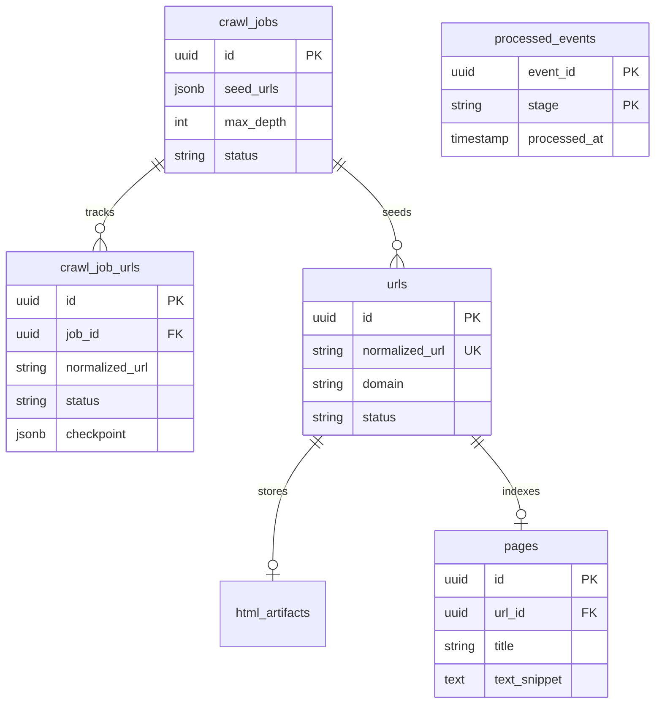

# Database ER Diagram

## Key Indexes

- `urls.normalized_url` (unique)
- `urls.job_id`
- `crawl_job_urls (job_id, status)`
- `pages.title` / `pages.text_snippet` (GIN pg_trgm)

## Design Notes

- **Global URL identity** in `urls` — one row per normalized URL
- **Per-job progress** in `crawl_job_urls` — many jobs can reference the same URL independently
- **Idempotency ledger** in `processed_events` — `(event_id, stage)` unique
