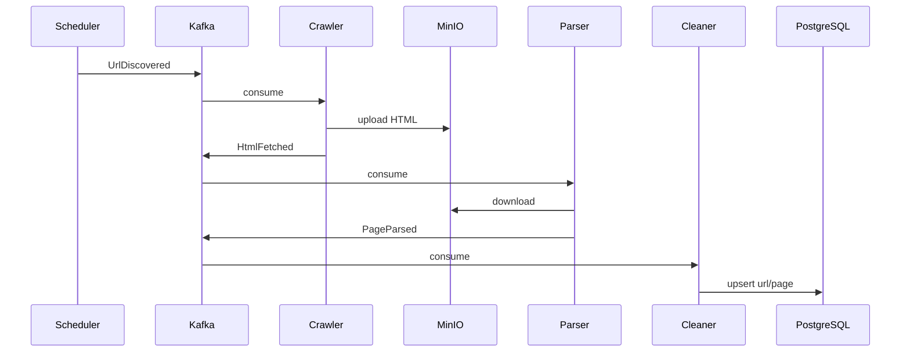

# Kafka Event Flow

## Topics

| Topic | Producer | Consumer | Payload |
|-------|----------|----------|---------|
| `argus.url.discovered` | Scheduler, Crawler, Retry | Crawler | `UrlDiscovered` |
| `argus.html.fetched` | Crawler | Parser | `HtmlFetched` |
| `argus.page.parsed` | Parser, Retry | Cleaner | `PageParsed` |
| `argus.url.failed` | Crawler, Parser, Cleaner | Retry | `UrlFailed` |
| `argus.dlq` | Retry, workers | dlq-replay | envelope |

## Sequence: Happy Path

## Delivery Semantics

1. Consumer reads message with `enable_auto_commit=False`
2. Handler completes (including downstream publish)
3. Offset committed
4. `processed_events` prevents duplicate side effects on replay

## Message Versioning

All events include `schema_version: 1`. Breaking changes require a new version and dual consumers during migration.

## Partition Keys

Messages keyed by `normalized_url` for per-URL ordering within a partition.
